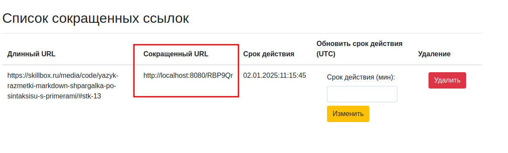
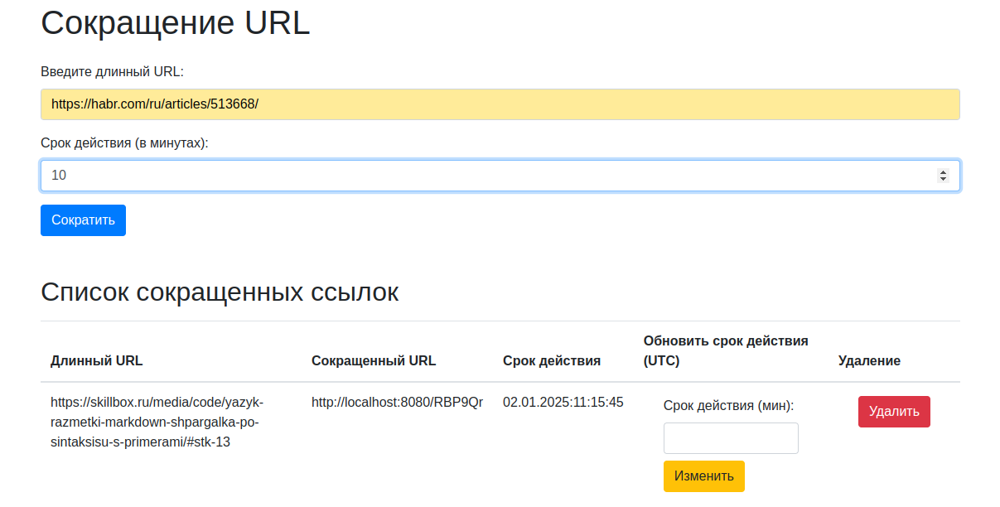

# Итоговый проект «Сервис коротких ссылок»

Данная работа является реализацией сервиса коротких ссылок, согласно условиям ниже, также ниже описано краткое описание реализации. В проекте реализованы юнит тесты только на основные бизнес сценарии, так как это не является основным условием задания.

## Реализованные условия задчи:

* Создание коротких ссылок. Система должна принимать длинный URL и преобразовывать его в короткую ссылку. Пример: при передаче ссылки https://www.baeldung.com/java-9-http-client вы должны получить короткий вариант clck.ru/3DZHeG.

Для создания короткой ссылки используется веб форма описанная в разделе `Как пользоваться`. Сервис `UrlShortenerService.java` реализует данную возможность на уровне приложения. В текущей реализации не предполагается использование сторонних сервисов, а собственной реализации. Алгоритм формирует ссылку на основании сохраненного набора символов. Символы подбираются рандомно в пределах ограниченной длинны ссылки. Сформированная ссылка сохраняется в БД(на данный момент H2 для простоты реализации) 

* Уникальные ссылки для каждого пользователя. Если один и тот же ресурс сокращают разные пользователи, они должны получать уникальные сокращенные ссылки.

В рамках одной HTTP сессии (для реализации данного функционала используется spring session) в атрибуты данной сессии сохраняется uuid пользователя. Он формируется при первом запросе и сохраняется в БД вместе со ссылкой. Соответственно, в рамках другой сессии будет сформирована уникальная ссылка. Для этого можно открыть браузер в режиме инкогнито. 

* Лимит переходов. Пользователь может задать максимальное количество переходов по ссылке. Как только этот лимит исчерпан, ссылка должна стать недоступной.

Счетчик переходов хранится в БД и в случае его исчерпания будет показано предупреждающее окно. Счетчик увеличивается при каждом переходе по ссылке. По умолчанию лимит 10.

* Ограничение времени жизни ссылки. Время жизни ссылки должно задаваться системой и ограничиваться определенным сроком (например, сутки). После истечения этого срока ссылка должна автоматически удаляться.

При создании ссылки будет сформировано время ее устаревания. Для этого берется текущее время и срок жизни указанный пользователем на форме. Срок указан в минутах. Минимальное значение ограничено в  настройках (по умолчанию это 10 минут). Если значение меньше, данного минимума, то будет применено данное значение(в описании задания не определено поведение в данном случае, поэтому мной заложена такая логика). Для очистки устаревших ссылок используется регламентное задание в `ExpiredLinkService.java` которое срабатывает также раз в 10 минут.

* Уведомление пользователя. Пользователь должен получать уведомление, если лимит переходов исчерпан или время жизни ссылки истекло.

Если ссылка не существует, устарела или была удалена, тогда при переходе по ней пользователь получит соответствующее сообщение. Данные кейсы более подробно описаны в разделе `Как пользоваться` 

* Идентификация пользователя по UUID. Каждый пользователь идентифицируется без авторизации с помощью UUID, который генерируется при первом запросе на создание короткой ссылки. Этот UUID используется для отслеживания всех действий пользователя с его ссылками.

Реализация данного условия описана выше, в разделе `Уникальные ссылки для каждого пользователя.`. Авторизация пользователя для работы с системой не требуется 

## Описание запуска
Для локального запуска приложения необходимо: 
1. С клонировать репозиторий
2. Сформировать конфигурацию запуска и запустить и с помощью встроенных средств используемой вами IDE

Также можно собрать .jar файл приложения с помощью gradle и запустить из консоли. Запуск с помощью докер не предусмотрен. Запуск приложений с помощью систем контейнеризации был рассмотрен в других модулях программы.

## Как пользоваться

Для начала работы с приложением необходимо перейти по адресу http://localhost:8080. В результате вы получите форму где надо будет вести урл, который вы хотите сократить.

После ввода урал и при нажатии на кнопку `сократить`, будет получено окно типа:

Где красным выделена ссылка, которую можно скопировать и перейти по ней.

Количество переходов по ссылке ограничено настройками приложения. Если количество переходов превышено, тогда вы увидите данное сообщение и вам будет предложено сформировать ссылку заново.

Если ссылки по которой вы собираетесь перейти нет, то будет получено следующее сообщение 

Если при сокращении ссылки не ввести урл, то будет получено следующее сообщение:
